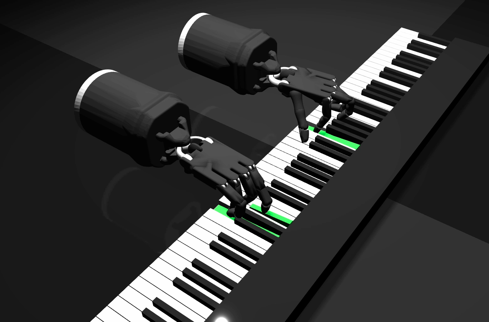
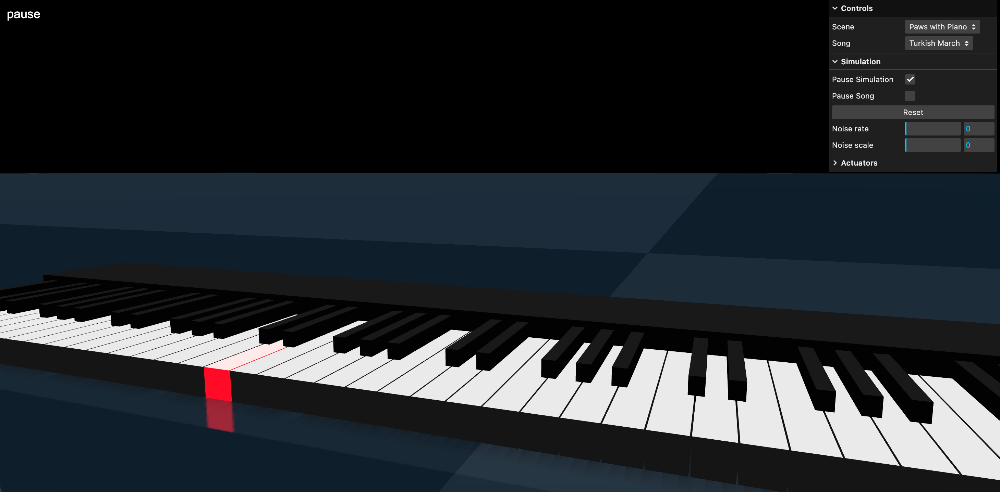

# PawzArt - Three.js MuJoCo WASM Piano Simulator 🎹🤖





A web-based physics simulator that demonstrates robotic piano playing using learned dexterity models with support for multiple robot configurations. Built with Three.js and MuJoCo WASM, featuring bimanual Shadow Hand robots performing classical piano pieces with realistic physics simulation, plus integration with the Unitree Go2 quadruped robot.

## 🎹 Overview

PawzArt combines advanced robotics simulation with musical performance, showcasing:
- **Bimanual dexterous manipulation** with Shadow Hand robots
- **Quadruped locomotion** with Unitree Go2 robot
- **Real-time physics simulation** powered by MuJoCo WASM
- **Interactive 3D visualization** using Three.js
- **Pre-trained piano performance models** with multiple classical pieces
- **Multi-robot scene composition** - combine different robots in single scenes
- **Web-based deployment** requiring no local installations

## 🚀 Getting Started

### Running the Simulator

No installation is required! All you need is a modern web browser with WebAssembly support and Node.js.

1. **Start a local server** from the project's root directory:
   ```bash
   npx serve
   ```
2. **Open the provided URL** in your browser (usually `http://localhost:3000`).
2. **Select a scene** from the Scene dropdown:
   - **Piano with Hands**: Original bimanual piano playing demo
   - **Unitree Go2 Robot**: Standalone quadruped robot simulation
   - **Piano + Go2 Combined**: Both robots in the same scene!
3. Select a song from the dropdown menu (for piano scenes)
4. Use spacebar to play/pause simulation
5. Press 'P' to pause/resume song playback
6. Drag objects in the scene to apply forces
7. Press F1 for help menu

## 🤖 Available Scenes

### 1. Piano with Shadow Hands
The original RoboPianist demonstration featuring:
- **Bimanual Setup**: Left and right Shadow Hand robots
- **High DOF**: 20+ actuated joints per hand
- **Precise Control**: Position-controlled actuators with realistic dynamics
- **Musical Performance**: Pre-trained control sequences for classical pieces

### 2. Unitree Go2 Robot
Standalone quadruped robot simulation:
- **12-DOF Locomotion**: Hip, thigh, and calf joints for each leg
- **Realistic Dynamics**: Based on official URDF specifications  
- **Physics Interaction**: Drag and apply forces to test stability

### 3. **NEW: Piano + Go2 Combined Scene**
The innovative superposition featuring both robots simultaneously:
- **Multi-robot Physics**: Both systems simulated in the same world
- **Shared Environment**: Piano and quadruped coexist with proper collision detection
- **Independent Control**: Separate actuator systems for each robot type
- **Scalable Architecture**: Demonstrates framework's multi-robot capabilities

## 🎵 Available Compositions

- **Turkish March** - Mozart
- **Für Elise** - Beethoven  
- **Piano Sonata No. 16 K545** - Mozart
- **Nocturne Op. 9 No. 2** - Chopin
- **Twinkle Twinkle Little Star** - Traditional

Each composition includes pre-trained control sequences (.npy files) with learned finger movements.

## 🔧 Technical Implementation

### Scene Architecture
The modular scene system allows for flexible robot combinations:

```javascript
// Scene switching with automatic asset loading
parentContext.gui.add(parentContext.params, 'scene', {
  "Piano with Hands": "piano_with_shadow_hands/scene.xml",
  "Unitree Go2 Robot": "unitree_go2/scene.xml", 
  "Piano + Go2 Combined": "piano_with_go2/scene.xml"
}).onChange(() => reloadFunc.call(parentContext));
```

### Multi-Robot Scene Composition
The combined scene XML demonstrates advanced MuJoCo features:
- **Shared Default Classes**: Separate defaults for each robot type
- **Asset Namespace Management**: Organized mesh and material loading
- **Coordinated Physics**: Unified timestep and solver settings
- **Spatial Positioning**: Strategic placement to avoid collisions

### Asset Loading Pipeline
```javascript
// Automatic asset detection and loading
let allFiles = [
  // Shadow Hand assets
  "piano_with_shadow_hands/*.obj",
  // Unitree Go2 assets  
  "unitree_go2/assets/*.obj",
  // Combined scene definition
  "piano_with_go2/scene.xml"
];
```

### Control System Flexibility
- **Scene-Aware Processing**: Piano controls only active in piano scenes
- **Modular Actuators**: Independent control for each robot system
- **Runtime Switching**: Live scene changes without restart

## 🎛️ Controls Reference

| Key | Action |
|-----|--------|
| `Space` | Play/Pause Simulation |
| `P` | Play/Pause Song (Piano scenes only) |
| `Backspace` | Reset Simulation |
| `F1` | Toggle Help Menu |
| `Ctrl+A` | Reset Camera View |
| `Mouse Drag` | Apply Forces to Bodies |

## 🔬 Advanced Features

### Multi-Robot Physics
- **Collision Detection**: Robots can interact with each other and environment
- **Shared Dynamics**: Unified physics world with consistent material properties
- **Independent DOF**: Each robot maintains its own joint and actuator systems

### Adaptive Camera System
- **Scene-Aware Positioning**: Camera automatically adjusts for different scenes
- **Optimal Viewing**: Pre-configured viewpoints for each robot configuration
- **Smooth Transitions**: Seamless switching between scene types

### Noise Injection & Testing
- **Control Noise**: Add Gaussian noise to joint commands
- **Robustness Testing**: Evaluate performance under uncertainty
- **Real-time Perturbations**: Interactive force application during simulation

## 📁 Project Structure

```
pawzart/
├── examples/
│   ├── main.js                    # Main application class
│   ├── mujocoUtils.js            # MuJoCo integration utilities
│   ├── scenes/
│   │   ├── piano_with_shadow_hands/     # Original piano scene
│   │   │   ├── scene.xml
│   │   │   ├── *.obj               # Hand mesh files
│   │   │   └── *.npy               # Control sequences
│   │   ├── unitree_go2/                 # Quadruped robot scene
│   │   │   ├── scene.xml
│   │   │   └── assets/             # Robot mesh files
│   │   └── paws_with_piano/              # 🆕 Combined scene
│   │       └── scene.xml           # Multi-robot configuration
│   └── utils/                     # Utility modules
├── dist/                          # Compiled MuJoCo WASM
├── lib/                           # Static libraries
├── include/                       # MuJoCo headers
└── index.html                     # Entry point
```

## 🧠 Key Innovations

### 1. **Agentically Superposed Multi-Robot Scenes**
The combined piano_with_go2 scene demonstrates:
- Heterogeneous robot integration in single physics world
- Namespace management for complex asset hierarchies
- Independent control systems operating simultaneously

### 2. **Dynamic Scene Architecture**
- Runtime scene switching without application restart
- Automatic asset loading based on scene requirements
- Adaptive UI that responds to current scene capabilities

### 3. **Scalable Physics Framework**
- Modular robot definitions that compose cleanly
- Shared material and lighting systems
- Extensible to additional robot types

## 🛠️ Development & Extension

### Adding New Robot Types
1. Create robot XML definition in `examples/scenes/new_robot/`
2. Add assets to scene directory
3. Update `downloadExampleScenesFolder()` with new files
4. Add scene option to GUI dropdown
5. Implement robot-specific control logic if needed

### Creating Custom Multi-Robot Scenes
```xml
<mujoco model="custom_multi_robot">
  <!-- Include multiple robot definitions -->
  <include file="../robot_a/robot_a.xml"/>
  <include file="../robot_b/robot_b.xml"/>
  
  <worldbody>
    <!-- Position robots in shared world -->
    <body name="robot_a_instance" pos="1 0 0">
      <!-- Robot A configuration -->
    </body>
    <body name="robot_b_instance" pos="-1 0 0">
      <!-- Robot B configuration -->
    </body>
  </worldbody>
</mujoco>
```

## 📊 Performance Characteristics

- **Real-time Physics**: 500Hz simulation timestep in browser
- **Efficient Rendering**: Selective geometry processing and material caching
- **Memory Management**: Proper cleanup during scene transitions
- **Asset Optimization**: Mesh compression and texture management

## 🔍 Debugging & Development

### Browser DevTools Integration
- JavaScript debugging with source maps
- WebAssembly debugging support
- Performance profiling capabilities

### Physics Visualization
- MuJoCo built-in contact visualization
- Force vector display
- Joint limit visualization

## 🤝 Contributing

We welcome contributions! Areas of interest:
- Additional robot models and scenes
- Enhanced control algorithms
- Performance optimizations
- New musical pieces and training data

## 📄 License

This project is licensed under the MIT License - see the [LICENSE](LICENSE) file for details.

## 🙏 Acknowledgments

- **MuJoCo**: Advanced physics simulation engine
- **Three.js**: 3D graphics rendering framework
- **RoboPianist**: Original research and training data
- **Shadow Robot Company**: Dexterous hand hardware specifications
- **Unitree Robotics**: Go2 quadruped robot model
- **DeepMind**: MuJoCo development and WASM port

---

**Ready to explore multi-robot simulation?** Load the "Piano + Go2 Combined" scene and witness the future of heterogeneous robotic systems in action! 🎹🤖 
